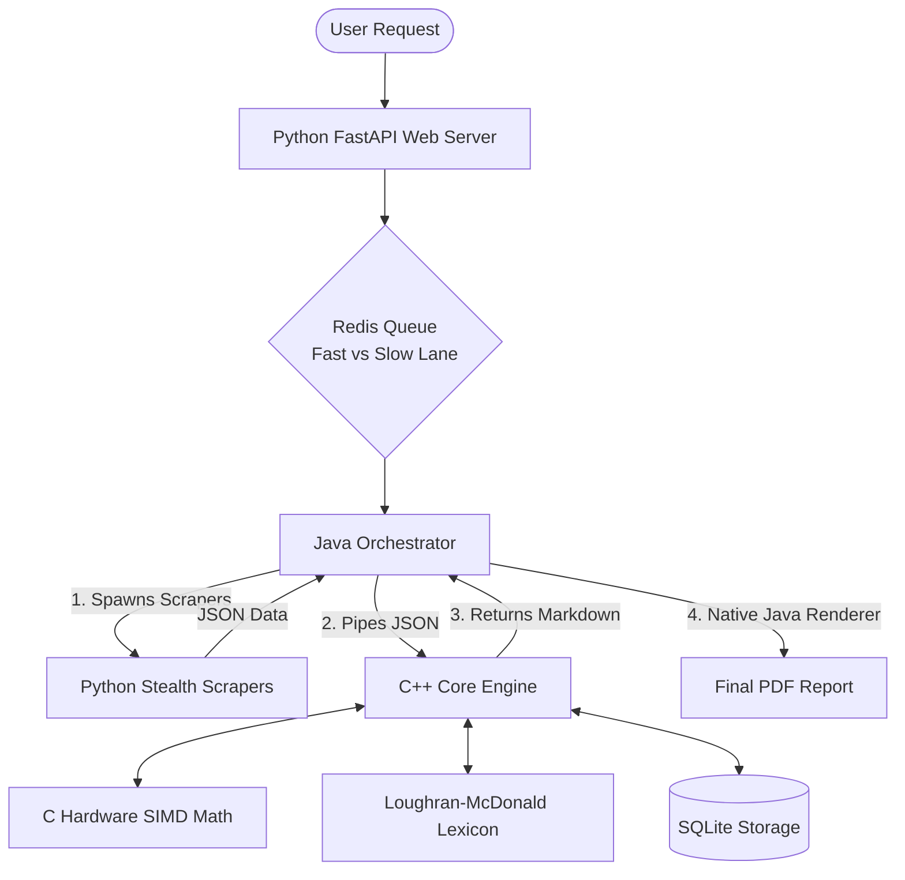
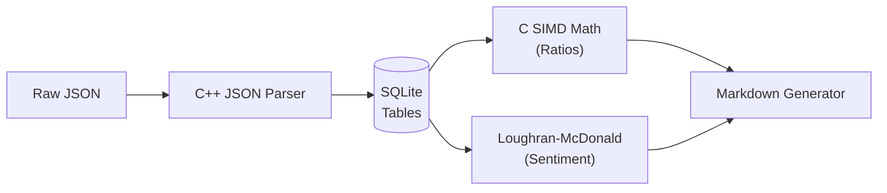
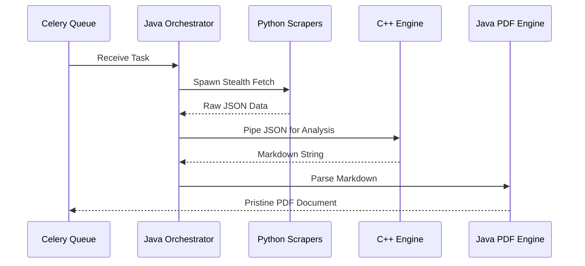
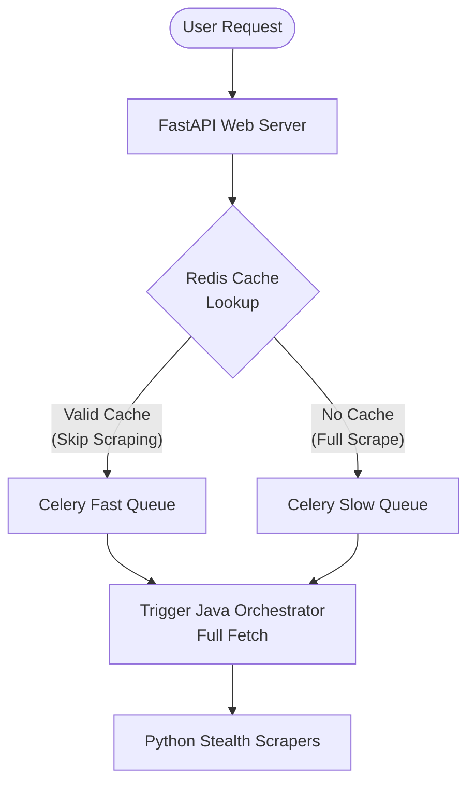
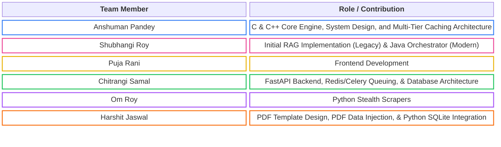

# AlphaLens

<div align="center">


> An ultra-low latency, hardware-accelerated pipeline that automates equity research for Indian-listed companies (NSE/BSE) — pulling financials and news, then computing ratios, sentiment, and peer comparisons, all the way toward a pristine PDF investment memo in under 12 seconds.

</div>

---

## 1. The Concept & The Anti-LLM Approach

Manual equity research means reading a company's financial statements, exchange filings, earnings call transcripts, and recent news separately, then manually cross-referencing them to form a view. That's slow, repetitive, and doesn't scale past a handful of companies.

While the modern trend is to throw Large Language Models (LLMs) at every data problem, we explicitly chose **NOT** to use LLMs for this pipeline. 
- **The Problem with LLMs:** They are notoriously slow, incredibly expensive at scale, and prone to hallucinating critical financial numbers. 
- **Our Implementation:** Instead of asking an AI to "guess" financial health, we use deterministic, hardware-accelerated C math to calculate exact financial ratios (Liquidity, Leverage, Profitability). For sentiment analysis, instead of a slow neural network, we use a blazing-fast C++ implementation of the **Loughran-McDonald Financial Lexicon**—a highly specialized dictionary mapped specifically to financial jargon. 

This guarantees 100% mathematical accuracy, zero hallucinations, and sub-12 second generation times across the entire stack.

### Architecture Diagram
Here is how the entire polyglot system fits together:



---

## 2. The Core Engine (C & C++)

### Detailed Working
The C/C++ engine is the heart of the analytical pipeline. It does not perform network requests; instead, it receives raw JSON payloads (harvested by the Python scrapers) and performs highly intensive data processing:
- **Embedded Storage (SQLite):** Upon startup, the engine spins up an embedded SQLite database (`invest.sqlite`). It parses the colossal raw JSON strings and normalizes the financial line items into structured relational tables for instant querying.
- **Hardware-Accelerated Math (C SIMD):** The C++ engine delegates mathematical calculations to a custom, native C library (`simd_math.c`). This library utilizes SIMD (Single Instruction, Multiple Data) CPU hardware instructions to evaluate arrays of floating-point numbers simultaneously.
- **Offline Lexicon Sentiment:** The engine scans through paragraphs of recent news articles, instantly tagging and scoring financial sentiment as POSITIVE, NEGATIVE, or NEUTRAL using the offline Loughran-McDonald dictionary without a single API call.

### Why this Language?
C++ offers raw execution speed and zero-garbage-collection overhead, eliminating latency spikes. By dropping down into raw C for SIMD instructions, we maximize the hardware capabilities of the server's CPU, allowing the mathematical engine to process the entire dataset in exactly ~1.0 second.



---

## 3. The Handler & Renderer (Java)

### Detailed Working
Java operates as the master orchestrator and the final document renderer of the pipeline. 
- **Process Orchestration:** Java spawns the isolated Python network scraper scripts as child processes, monitors their exit codes, and intercepts their JSON outputs. It then invokes the compiled C++ binary and pipes the data into it.
- **Dynamic Peer Benchmarking:** Before rendering the report, Java analyzes the target company's industry sector. It dynamically maps and queries peer companies (e.g., matching Infosys with TCS and Wipro) to generate comparative benchmarking arrays on the fly.
- **Dependency-Free PDF Rendering:** Utilizing the `Flying Saucer` and `OpenPDF` Java libraries, Java takes the Markdown generated by C++ and natively paints a beautifully formatted PDF report. 

### Why this Language?
Java excels at robust, multi-threaded process management, making it perfect for orchestrating child scripts. By using native Java PDF libraries, we bypass the need to install bloated Python PDF generators (like Weasyprint or GTK3 dependencies). Java compiles the layout and renders the final PDF in roughly 200 milliseconds.



---

## 4. Backend Orchestration & Network Connector (Python)

### Detailed Working
Python handles all external network interactions. It acts as the public-facing REST API, the Queue Manager, and the Stealth Web Scraper.

#### A. The Heist (Stealth Scraping)
A dedicated Python layer acts purely as a stealth network scraper. It dynamically establishes covert, cookie-authenticated sessions with Yahoo Finance to pull pristine financial data. By stripping Python of any heavy analysis duties and using it strictly for stealth I/O, we mimic human browser traffic perfectly and bypass strict Web Application Firewalls (WAFs).

#### B. The Fast Queue vs Slow Queue
To manage high user traffic without crashing our strict 512MB RAM server limit, the Python FastAPI server places incoming user requests into a **Celery Queue** backed by a **Redis** message broker.
- **The Slow Queue:** If a ticker has not been searched today, Celery instructs Java to spawn the stealth scrapers and pull fresh data from the internet (~11 seconds).
- **The Fast Queue:** When a report is generated, Python stores a cache flag in Redis (expires at 9:00 AM IST). If requested again, FastAPI routes the request to the Fast Queue. This instructs Java to **skip the web scraping entirely** and load data directly from the local C++ cache (<3 seconds).

### Why this Language?
Python is the undisputed king of web APIs and network scraping. FastAPI and Celery provide a rock-solid queuing system. Python's advanced asynchronous network libraries (`curl-cffi`, `requests`) allow us to bypass TLS fingerprinting and firewalls that would normally block C++ or Java.



---

## 5. The Frontend (JavaScript, React, Node.js, HTML, CSS)

### Detailed Working
The user-facing web interface is built using modern **React** (JavaScript), structured with **HTML5**, and styled via **CSS3**. Node.js is utilized for package management and building the frontend assets.
- **Interactive Dashboard:** Users can search for Indian stock tickers, view live queue statuses via polling the Python FastAPI backend, and download their finalized PDF reports.
- **Responsive UI:** The CSS ensures the application is completely accessible across mobile and desktop devices.

### Why this Language?
JavaScript and React are the industry standards for building dynamic, reactive user interfaces in the browser. They excel at managing UI states and rendering components efficiently.

### Why not shift everything to JavaScript/Node.js?
While Node.js is incredibly popular for full-stack development, using it for this entire pipeline **cannot be the solution**.
- **CPU Bottlenecks:** Node.js runs on a single-threaded event loop. If we attempted to process the massive financial JSON payloads and calculate SIMD-level math in V8 (JavaScript), it would block the entire server for seconds, destroying concurrency.
- **Process Orchestration:** Node.js lacks the robust, low-level multi-threaded child-process management that Java provides. Java orchestrates the Python scrapers and C++ binaries far more efficiently without memory leaks.
- **Precision:** Financial calculations require strict static typing and exact memory allocation to avoid floating-point errors, which JavaScript's dynamic Number type struggles to guarantee at high speeds compared to C++.

---

## 6. The Databases (SQL)

> [!WARNING]
> **Supabase / PostgreSQL Limitations:** The production Supabase database integration is currently broken. Due to the very strict connection limits on the Supabase free tier, the PostgreSQL database gets overwhelmed quickly, causing analytics recording to fail.

To ensure maximum performance and user tracking, the system splits its database responsibilities across two vastly different SQL paradigms:

### A. The Analytical Database (Embedded SQLite)
**Purpose:** Lightning-fast, temporary data storage during the C++ mathematical run.
- When the C++ engine boots up for a specific ticker, it spins up a local `invest.sqlite` file in memory/disk. 
- It normalizes the massive, chaotic JSON payloads from Yahoo Finance into strict relational SQL tables (e.g., `IncomeStatement`, `BalanceSheet`). 
- This allows the C SIMD math library to instantly run `SELECT` queries across arrays of financial data, rather than traversing deeply nested JSON nodes.

### B. The Production Database (Supabase / PostgreSQL)
**Purpose:** Persistent user authentication and analytics recording.
- Handled by the Python FastAPI backend, **Supabase** acts as the cloud PostgreSQL instance.
- **Recording Analytics:** Every time a user successfully generates a PDF, the backend records an entry in Supabase noting the `user_id`, `ticker`, `generation_time`, and `cache_hit_status`. This allows us to track system usage, pinpoint which stocks are trending, and monitor API costs at scale.

---

## 7. Benchmark Results (Render Free Tier)

This entire polyglot architecture operates within a strict **512MB RAM and 0.1 vCPU** limit on the Render Free Tier. To survive the memory constraints, we restricted Celery concurrency to `1` worker. 

We ran a batch stress test where all **10 Indian IT and Bank tickers were triggered simultaneously**. 

| Ticker | Type | Queue Wait + Generation Time | Actual PDF Generation Speed |
|--------|------|------------------------------|-----------------------------|
| **INFY** | IT | 12.48s | 11.24s |
| **TCS** | IT | 22.84s | 10.49s |
| **WIPRO** | IT | 33.22s | 10.40s |
| **HCLTECH** | IT | 43.46s | 10.38s |
| **TECHM** | IT | 53.75s | 10.37s |
| **HDFCBANK** | Bank | 61.94s | 7.77s |
| **ICICIBANK** | Bank | 70.06s | 7.81s |
| **SBIN** | Bank | 78.16s | 8.17s |
| **KOTAKBANK** | Bank | 84.25s | 7.47s |
| **AXISBANK** | Bank | 92.37s | ~8.00s |

> **Note:** The "Queue Wait" time accumulates sequentially because the queue handles them one at a time. **The actual raw generation speed is ~10s for IT stocks and ~7s for Bank stocks per PDF from start to finish.** Subsequent requests route to the Fast Queue and execute in under 3 seconds!

---

## 8. Project Structure

This is the full intended structure for the project.

```
├── cpp/                        [DONE]  The Engine (Math, SQLite, Sentiment)
│   ├── src/
│   │   ├── main.cpp                  Native JSON parsing & execution entry point
│   │   ├── ratios.cpp                Financial ratio definitions
│   │   ├── lexicon_sentiment.cpp     Lexicon-based sentiment scoring
│   │   ├── storage.cpp               Embedded SQLite operations
│   │   ├── json_snapshot_writer.cpp  Native JSON reporting snapshot generator
│   │   └── cache_utils.h             Memory cache utilities
│   └── build/                        CMake build artifacts
│
├── C maths/                    [DONE]  The Accelerator (Hardware C Math)
│   ├── simd_math.c               Hardware-accelerated C vector math
│   └── fast_ratios.c             Native C math fallbacks
│
├── java/                       [DONE]  The Orchestrator & Renderer
│   ├── src/
│   │   ├── Main.java                 Master entry point
│   │   ├── ApiFetcher.java           Spawns async Python network processes
│   │   ├── NewsManager.java          Robust NewsAPI aggregator and dynamic searcher
│   │   ├── CppEngine.java            Executes native C++ binary and pipes data
│   │   └── PdfGenerator.java         Dependency-free native PDF generation
│   ├── lib/
│   │   ├── flying-saucer-core.jar    Native Java rendering engine
│   │   └── openpdf.jar               OpenPDF engine
│   └── bin/                          Compiled class files
│
├── backend/                    [DONE]  FastAPI wrapper, Celery & Redis Queue
│   ├── main.py                   FastAPI entry point
│   ├── worker.py                 Celery tasks (Fast & Slow lanes)
│   └── celery_app.py             Queue configuration
│
├── python/                     [DONE]  The Facade (Network Scripts)
│   └── tricker.py                Lightweight python network I/O script (The Heist)
│
├── frontend/                   [DONE]  The User Interface (React, Vite)
│   ├── src/                          React components and pages
│   ├── public/                       Static assets
│   ├── package.json                  Node dependencies
│   └── vite.config.js                Vite bundler configuration
│
├── reports/                    [AUTO]  Output directory for `.pdf` files
├── invest.sqlite               [AUTO]  Embedded local database
├── requirements.txt
├── .env.example
├── Dockerfile
└── start.sh
```

---

## 9. Credits



**GitHub Profiles:**
- [Anshuman Pandey](https://github.com/AnshumanJ28)
- [Shubhangi Roy](https://github.com/ShubhangiRoy12)
- [Puja Rani](https://github.com/pujaux)
- [Chitrangi Samal](https://github.com/ChitrangiS)
- [Om Roy](https://github.com/omroy07)
- [Harshit Jaswal](https://github.com/jaiswalharshit9792)

---

## 10. Quick Start (Docker Deployment)

> [!WARNING]
> **Cloud Deployments (Render) are currently BROKEN:** While this system is optimized to survive the memory constraints of free cloud tiers, deploying it purely with free tools on Render or other clouds simply won't work out of the box. Yahoo Finance actively blocks IPs from known data centers, and even paid proxy services frequently fail. To deploy this to the web successfully, you must run the backend on a local machine (residential IP) and expose it using **Cloudflare Tunnels**. Therefore, we highly recommend running this locally via Docker!

### Option A: Local Setup via Docker (Recommended)
You can build and run the entire pipeline in an isolated container without installing C++ compilers or Python dependencies locally.

```bash
# 1. Build the Docker image
docker build -t invest-agent .

# 2. Run the container (pass your API keys and target ticker)
docker run -d -p 10000:10000 --name invest-backend --env-file .env invest-agent
```

### Option B: Local Setup
```bash
python -m venv venv
source venv/bin/activate  # (or .\venv\Scripts\activate on Windows)
pip install -r requirements.txt
```
Fill in your `.env` file with your API key (`NEWSAPI_KEY`).

**Run the full pipeline natively:**
```bash
java -cp "java/bin:java/lib/*" Main INFY.NS
```
*(Use a semicolon `;` instead of a colon `:` on Windows!)*
